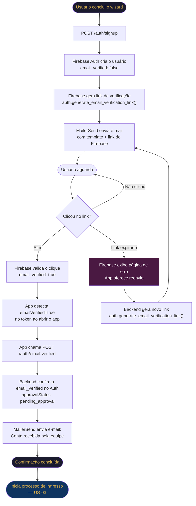

# US-02 — Confirmação de E-mail e Entrada em Fila de Aprovação

**Status:** Proposta
**Data:** 2026-03-12
**Módulos:** `backend`, `app`
**Complementa:** US-01 (Wizard de Criação de Conta), ADR-10 (Segurança), ADR-08 (Notificações)

---

## 1. Contexto e Objetivo

Após o usuário concluir o wizard de criação de conta (US-01), a conta existe no sistema mas ainda não está confirmada nem aprovada. Este processo cobre **tudo que acontece entre o submit do wizard e o início da análise pela equipe do Spartacus**.

O objetivo é duplo:

1. **Verificar que o e-mail informado é válido e pertence ao usuário** — protege contra cadastros com e-mails falsos ou erros de digitação.
2. **Comunicar de forma clara e personalizada** o que o usuário deve esperar — reduzindo ansiedade e contato desnecessário com a equipe.

O processo termina quando o usuário confirma o e-mail. A partir desse ponto, inicia-se o **processo de análise e ingresso** (fora do escopo desta US).

### Princípio arquitetural

> **Deixar as ferramentas trabalharem no limite de suas possibilidades.**
>
> A infraestrutura de verificação de e-mail (geração do link seguro, validade, validação do clique, reenvio) é delegada integralmente ao **Firebase Auth**. O **MailerSend** cuida exclusivamente da entrega e identidade visual. O backend orquestra, mas não reinventa o que as plataformas já resolvem.

---

## 2. Estados da Conta

```
┌─────────────────┐   submite wizard    ┌─────────────────┐
│   (não existe)  │ ──────────────────► │  pending_email  │
└─────────────────┘                     └────────┬────────┘
                                                 │
                                  e-mail confirmado (Firebase)
                                  app detecta emailVerified=true
                                                 │
                                                 ▼
                                        ┌─────────────────┐
                                        │ pending_approval │  ◄── início do processo de ingresso
                                        └────────┬────────┘
                                                 │
                              ┌──────────────────┼──────────────────┐
                              │                                      │
                        admin aprova                          admin rejeita
                              │                                      │
                              ▼                                      ▼
                         ┌────────┐                           ┌──────────┐
                         │ active │                           │ rejected │
                         └────────┘                           └──────────┘
```

| Estado | Significado | Fonte de verdade | Acesso ao app |
|---|---|---|---|
| `pending_email` | Conta criada, e-mail não confirmado | `email_verified: false` no Firebase Auth | Nenhum |
| `pending_approval` | E-mail confirmado, aguardando equipe | `approvalStatus` no Firestore | Nenhum |
| `active` | Aprovado pela equipe | `approvalStatus` no Firestore | Completo |
| `rejected` | Reprovado pela equipe | `approvalStatus` no Firestore | Nenhum |

> **Impacto na implementação do `POST /auth/signup`:** a conta deve ser criada com `approvalStatus: "pending_email"`. O campo `email_verified` do Firebase Auth é a fonte de verdade para o estado de confirmação — não armazenamos token próprio no Firestore.

---

## 3. Fluxo de Negócio



---

## 4. Verificação de E-mail via Firebase Auth

### 4.1 Responsabilidades por plataforma

| Responsabilidade | Firebase Auth | MailerSend | Backend |
|---|---|---|---|
| Gerar link seguro com token | ✅ | | |
| Controlar validade do link | ✅ | | |
| Validar o clique | ✅ | | |
| Gerenciar reenvio | ✅ (novo link) | | |
| Entregar o e-mail | | ✅ | |
| Template com identidade visual | | ✅ | |
| Conteúdo dinâmico por perfil | | ✅ | |
| Orquestrar o fluxo | | | ✅ |
| Atualizar `approvalStatus` | | | ✅ |
| Enviar e-mail de conta recebida | | ✅ | ✅ (dispara) |

### 4.2 Geração do link

```python
# No POST /auth/signup, após criar o usuário no Firebase Auth
link = auth.generate_email_verification_link(email)
email_service.send_confirmation(to=email, link=link, ...)
```

O Firebase gerencia internamente o token, a validade e a invalidação após uso. Nenhum campo de token é armazenado no Firestore.

### 4.3 Detecção da confirmação

O Firebase Auth não envia webhook quando o usuário confirma o e-mail. A detecção acontece **no lado do app**, de forma passiva:

1. O app reabre ou o usuário tenta acessar uma funcionalidade.
2. O SDK do Firebase atualiza o token do usuário — `emailVerified` passa a `true`.
3. O app detecta a mudança e chama `POST /auth/email-verified`.
4. O backend verifica `auth.get_user(uid).email_verified == True` e atualiza o Firestore.

### 4.4 Reenvio

Reenvio por iniciativa do usuário (tela "conta pendente" no app):

```python
# Gera novo link — invalida o anterior automaticamente
link = auth.generate_email_verification_link(email)
email_service.send_confirmation(to=email, link=link, ...)
```

Não há estado extra para limpar no Firestore — o Firebase cuida da invalidação do link anterior.

---

## 5. E-mails

Todos os e-mails são enviados via **MailerSend** com template de identidade visual do Projeto Spartacus (logo, paleta `#0B0D12` / `#C6A34E`, tipografia Oswald para títulos). O link embutido no e-mail de confirmação é **gerado pelo Firebase Auth**.

---

### 5.1 E-mail de Confirmação de E-mail

**Assunto:** `Confirme seu e-mail — Projeto Spartacus`

**Conteúdo fixo (todos os perfis):**

> Olá, **{Nome}**,
>
> Recebemos sua solicitação de cadastro no Projeto Spartacus.
> Para continuar, confirme seu e-mail clicando no botão abaixo.
>
> [**CONFIRMAR MEU E-MAIL**] → `{link gerado pelo Firebase}`
>
> Se você não solicitou esse cadastro, ignore este e-mail.

**Seção de resumo por perfil** — exibida abaixo do botão:

---

#### Perfil: Aluno / Professor / Instrutor

> **Resumo do seu cadastro:**
> - Nome: {nome}
> - E-mail: {email}
> - Telefone: {telefone}
> - Turmas selecionadas: {turma 1}, {turma 2}, ...

---

#### Perfil: Responsável (sem turmas próprias)

> **Resumo do seu cadastro:**
> - Nome: {nome}
> - E-mail: {email}
> - Telefone: {telefone}
>
> **Dependentes cadastrados:**
> | Nome | Idade | Turmas |
> |---|---|---|
> | {nome dep 1} | {idade} | {turma A}, {turma B} |
> | {nome dep 2} | {idade} | {turma C} |

---

#### Perfil: Responsável + Aluno

> **Resumo do seu cadastro:**
> - Nome: {nome}
> - E-mail: {email}
> - Telefone: {telefone}
> - Suas turmas: {turma 1}, {turma 2}
>
> **Dependentes cadastrados:**
> | Nome | Idade | Turmas |
> |---|---|---|
> | {nome dep 1} | {idade} | {turma A}, {turma B} |

---

#### Perfil: Apoiador / Patrocinador

> **Resumo do seu cadastro:**
> - Nome: {nome}
> - E-mail: {email}
> - Telefone: {telefone}

---

### 5.2 E-mail de Conta Recebida pela Equipe

Enviado pelo backend imediatamente após detectar `email_verified: true` e atualizar o status para `pending_approval`.

**Assunto:** `Cadastro recebido — aguardando análise`

> Olá, **{Nome}**,
>
> Seu e-mail foi confirmado com sucesso!
>
> Seus dados foram recebidos pela equipe do Projeto Spartacus e estão em análise.
> Você receberá uma confirmação por **e-mail** assim que seu cadastro for aprovado.
>
> Para não perder nenhuma atualização, **ative as notificações no aplicativo**:
> Abra o app → toque no seu perfil → ative "Permitir notificações".
>
> Obrigado por fazer parte do Spartacus!
>
> **Equipe Projeto Spartacus**
> Brasnorte — MT

---

## 6. Regras de Negócio

| # | Regra |
|---|---|
| RN-01 | Um usuário com `approvalStatus: pending_email` não tem acesso a nenhuma funcionalidade do app. |
| RN-02 | A fonte de verdade para o estado de confirmação de e-mail é o campo `email_verified` do Firebase Auth, não um campo no Firestore. |
| RN-03 | O reenvio do link de confirmação gera um novo link via Firebase — o link anterior é automaticamente invalidado. |
| RN-04 | A transição `pending_email → pending_approval` é disparada pelo app ao detectar `emailVerified: true` no token, chamando `POST /auth/email-verified`. |
| RN-05 | A idade dos dependentes exibida no e-mail é calculada no momento do envio. |
| RN-06 | O nome das turmas no e-mail é buscado da coleção `classes` pelos `classIds` informados no cadastro. |
| RN-07 | Apoiadores e patrocinadores não têm turmas — a seção de turmas não é exibida no e-mail. |
| RN-08 | O e-mail de conta recebida (5.2) é enviado uma única vez, no momento da transição para `pending_approval`. |
| RN-09 | O backend sempre reconfirma `email_verified` no Firebase Auth antes de atualizar o Firestore — nunca confia apenas no sinal do app. |

---

## 7. Implicações Técnicas

| Componente | O que muda |
|---|---|
| `POST /auth/signup` | Após criar o usuário no Firebase Auth, chama `generate_email_verification_link()` e envia e-mail via MailerSend. `approvalStatus` criado como `"pending_email"`. |
| `POST /auth/email-verified` | Novo endpoint autenticado. Verifica `email_verified` no Firebase Auth, atualiza `approvalStatus → "pending_approval"` no Firestore, envia e-mail de conta recebida. |
| `users/{uid}` | Sem campos de token — `email_verified` vive no Firebase Auth. |
| MailerSend | Dois templates: `signup-confirm` (link do Firebase + resumo por perfil) e `signup-received`. |
| App | Ao abrir o app com usuário logado, verifica `currentUser.emailVerified`; se `true` e status ainda `pending_email`, chama `POST /auth/email-verified`. |
| Landing page | Não precisa de rota `/confirmar` própria — o Firebase redireciona para uma URL configurável após validação. |

---

## 8. Fora de Escopo desta US

- Processo de análise e aprovação pela equipe (US-03).
- Tela "conta pendente" no app com botão de reenvio — depende desta US estar implementada.
- Notificações push — dependem de conta `active`.
- Lembretes automáticos para quem não confirma em X horas.
- Configuração da `actionCodeSettings` do Firebase (URL de redirecionamento pós-confirmação).
